# cmPlot
Function Plotter GUI made using python. 

Supported operands: ```+```, ```-```, ```*```, ```/``` and ```^```. 

Supported variables: ```x```. 

Supported characters: the operands above, only the variable ```x```, numbers from ```0``` to ```9``` and the ```.``` character for decimals.

# Dependencies
pysimpleGUI, numpy, matplotlib, sympy.

All dependencies can be installed by running the command ```pip install -r requirements.txt``` from the root project directory.

# Running the plotter
The plotter can be run by using the command ```python3 -m src.cmPlot``` from the project's root directory.

The project can be tested by running the command ```python3 -m test.test_input_verification``` from the project's root directory.

# Snapshots
**What the plotter looks like** <br />
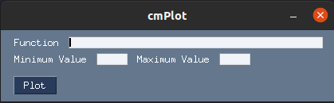
<br />
<br />


**Correct Example 1** <br />
<br />
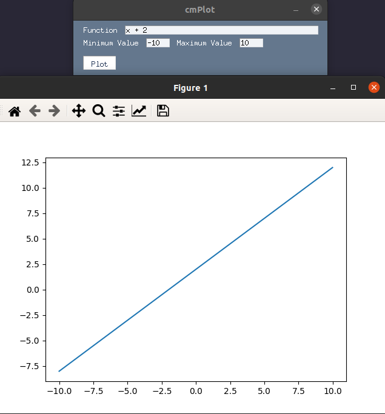<br />

**Correct Example 2** <br />
<br />
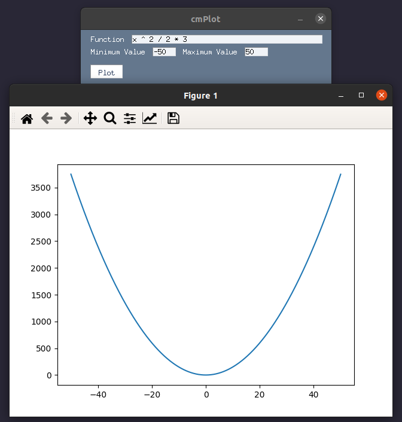<br />

**Correct Example 3** <br />
<br />
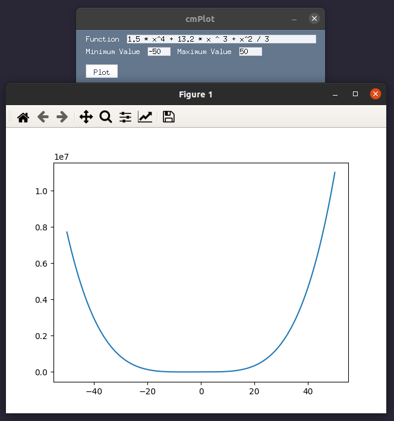<br />

<br />
<br />

**Incorrect Example 1** <br />
<br />
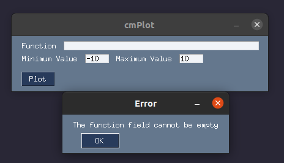<br />

**Incorrect Example 2** <br />
<br />
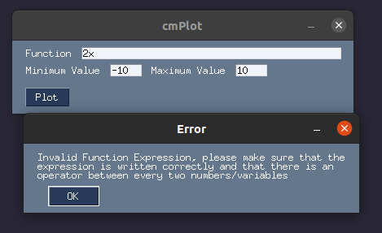<br />

**Incorrect Example 3** <br />
<br />
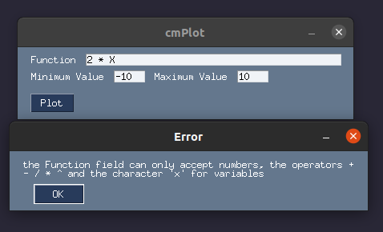<br />

**Incorrect Example 4** <br />
<br />
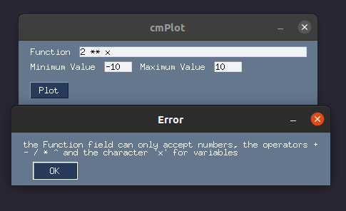<br />

**Incorrect Example 5** <br />
<br />
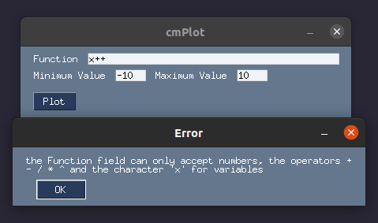<br />

**Incorrect Example 6** <br />
<br />
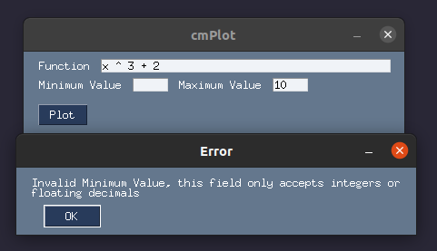<br />

**Incorrect Example 7** <br />
<br />
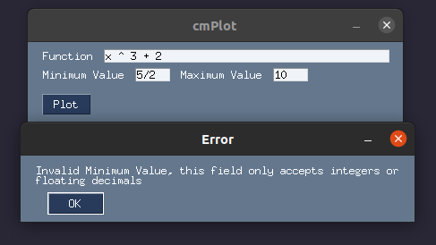<br />

**Incorrect Example 8** <br />
<br />
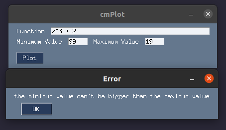<br />

# Notes about division by zero and discontinuities

This plotter supports division by zero in limited cases like division by zero (such as 1 / x) function. it doesn't support only infinite functions or functions with many discontinuities however (such as 1 / 0).

**Supported Example 1** <br />
<br />
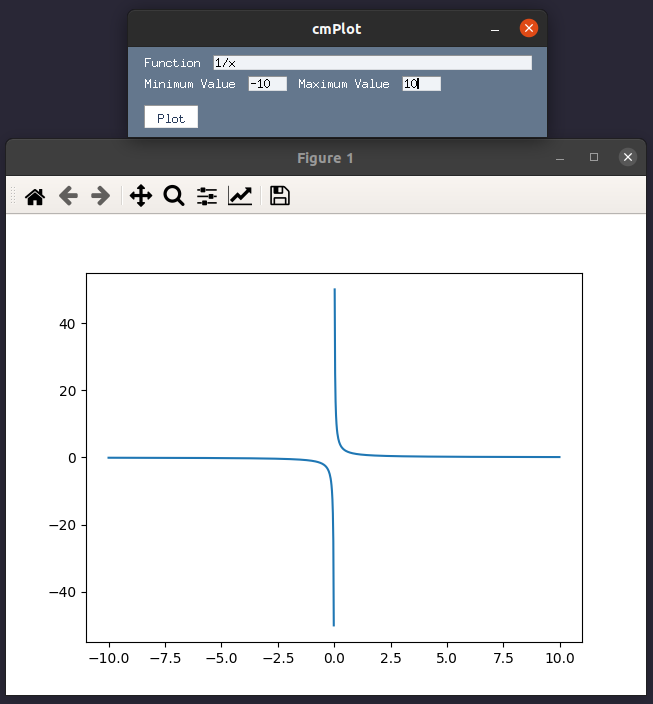<br />

**Unsupported Example 1** <br />
<br />
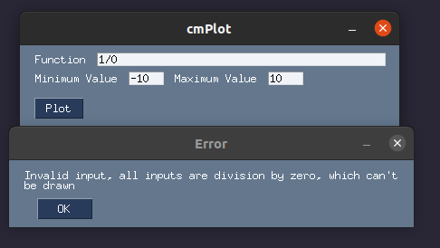<br />


